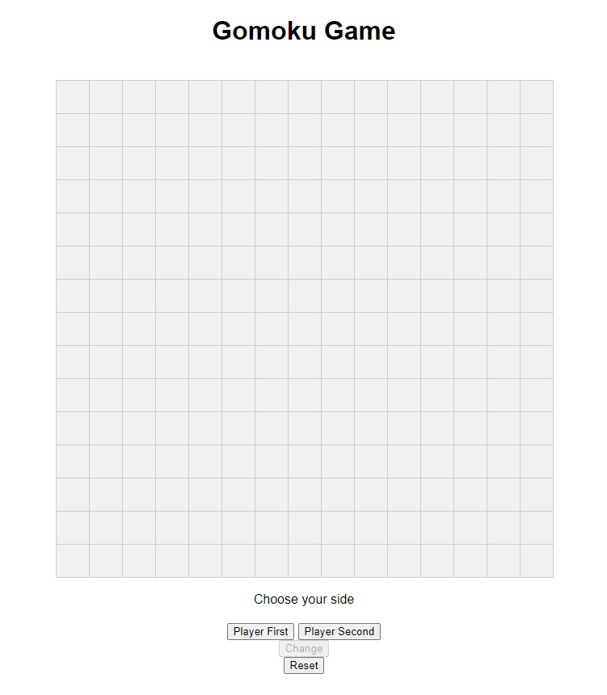

Report of Project Gomoku-AI

最终成果在 `demo` 文件夹中（包含前端和对应修改过的后端）

min-max 搜索写法为 `judge/src.cpp`，mcts 写法为 `judge/mcts.cpp`

编译命令均为 `g++ xxx.cpp -O3 -std=c++2a -o xxx`

min-max 搜索写法为确定性算法，相同局面会导致相同下法

评估函数（分别计算黑白棋得分）：

- 枚举棋盘八个方向所有同色的长度段，按照段的长度以及两端是否开放打分
- 枚举所有长度为 6 的长度段，对第 1 个位置的棋子按照这 6 个棋子的状态计算其分数，使用哈希预处理所有 $3^6$ 种 可能的得分，每次枚举整个棋盘上的所有状态并加上该状态的分数

- 单次落子只会影响八个方向经过该子的长度段，每次只修改分数的变化量
- 使用 zobrist 缓存减少重复计算（弃用，并未加速）

算法及优化：

- min-max 搜索 6 层，alpha-beta 剪枝，pvs 剪枝
- 启发式搜索，每层按顺序搜索前 20 个单步评分最优的位置，同时仅考虑已落子位置“周围”（5*5）的位置。
- 在搜索时加入“换手”作为可能策略
- 算杀模块：额外的 10 层 min-max 搜索，强行限制每步造成的分数变化必须大于某个给定值，模拟连续多次冲三，冲四（以减小搜索宽度）

落子速度：

单步平均 1s 内，某些复杂局面可能达到 5s（无法具体测试，但大部分棋局落子速度都显著很快，几乎达到 `baseline` 的水平）

胜率（均对战 64 局）：

`mcts_rand_50000`：64/0 100%

`mcts_rand_100000`：55/9 85.9%

`mcts_rand_200000`：52/11 81.3%

`mcts_rand_400000`：53/11 82.8%

`mcts_rand_600000`：38/25 59.3%

`mcts_rand_800000`：47/16 73.4%

前端：

通过 OX 表示棋子，支持选择先后手，重置棋盘

带有提示性信息（轮到玩家/AI，AI 换手提示，玩家换手提示，上一落子位置标红）

使用了 ChatGPT 辅助编写

遇到的问题及解决方案：

`evaluate.py`：

- UnicodeDecodeError: 'utf-8' codec can't decode byte 0xf8 in position 0: invalid start byte

- https://github.com/ray-project/ray/issues/45492

可能的优化方向：

- 对对手的算杀
- 可能的常数优化（评估，可能落子位置的保存再利用）
- 更好的评估函数（存疑）

MCTS bonus：

- 使用 UCB 函数计算下一步落子的位置
- 叶子节点随机落子直到棋局结束

感谢 汪畋宇 学长对前端的测试
